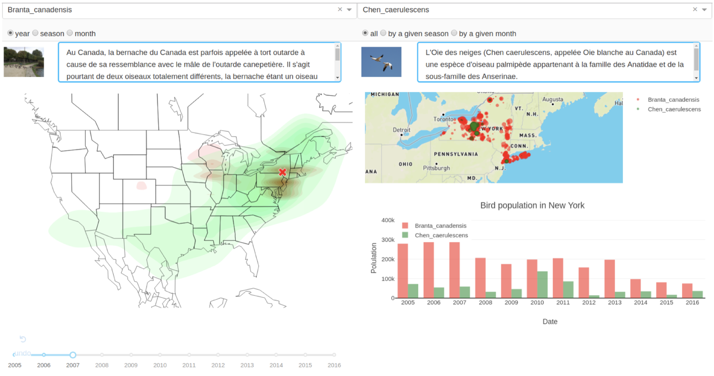

# Visualisation cartographique de données de recensement d’oiseaux

## Database used

The Cornell Lab has authorized us on reasoned request to use to a part of the database
EBird. This represents all censuses of North America between 2003 and 2016.
Each year corresponds to a csv. Each line of the base corresponds to a census. The
Fields of the Base are:

- SAMPLING EVENT ID: nominal, unique census identifier
- LOC ID: nominal, unique identifier of the geographical location
- LATITUDE: quantitative continuous
- LONGITUDE: quantitative continuous
- YEAR: categorial ordinal
- MONTH: categorial ordinal
- DAY: categorial ordinal
- TIME: TimeStamp
- COUNTRY: catégorial nominal
- STATE PROVINCE: catégorial nominal
- COUNTY: catégorial nominal
- COUNT TYPE: catégorial nominal
- EFFORT HRS: quantitativ continuous, duration of observation in hours
- EFFORT DISTANCE KM: quantitativ continueous, distance traveled during the observation
- EFFORT AREA HA: continuous quantitative, area covered during the observation
- OBSERVER ID: nominal categorical, unique identifier of the observer
- NUMBER OBSERVERS: quantative (integer), number of observers
- GROUP ID: catégorial nominal
- {Species name}: quantitative (integer), more than 3000 columns (1 per species) with the number
of individuals observed

## Proposed visualization

## Get started

Download the repository

## Dependencies

Note that this project has been performed using python3

Dependencies : Plotly, Dask (pip3 install youNameIt)

You will also need the Geos library. For Mac users, brew install geos

The last dependency is basemap. You can install it using this command :

sudo -H pip3 install https://github.com/matplotlib/basemap/archive/v1.1.0.tar.gz

In command line:
python Birds_viz.py

## More insight

See the report: Report_Birds_viz.pdf

# DataViz
